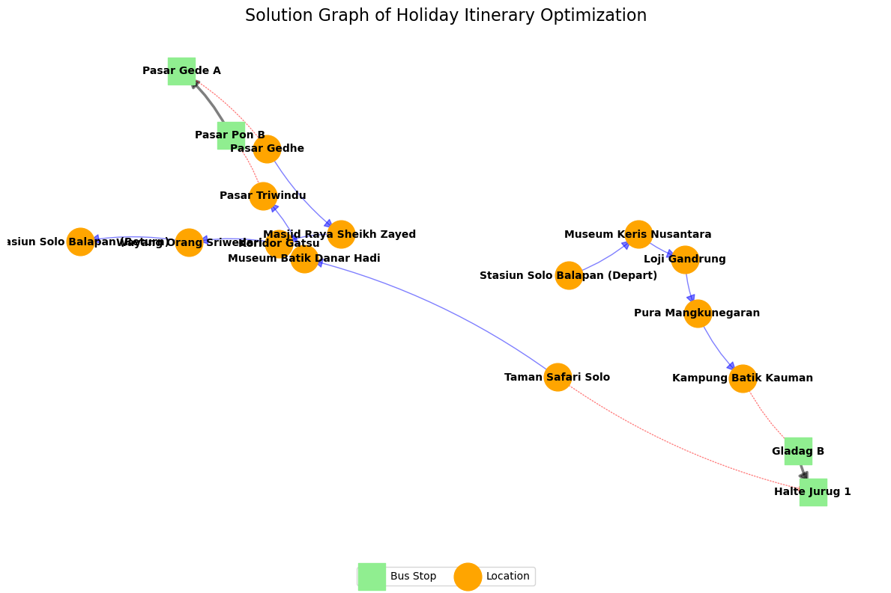

# 🗺️ Holiday Itinerary Optimization: A Multi-Modal Approach


> *Figure 1: The optimized itinerary map. **Red lines** represent fast ride-hailing trips, while **Blue dashed lines** indicate economical public bus rides. The algorithm automatically selects the best mode for each leg.*

## 📌 Project Overview
Surakarta (Solo) is a city rich in culture, but exploring its scattered attractions efficiently within a limited timeframe and budget is a complex challenge.

This project solves the **"Holiday Itinerary Puzzle"** by modeling it as a **Multi-Modal Orienteering Problem with Time Windows (OPTW)**.

Instead of just finding the shortest path, this model acts as a smart travel assistant. It strategically selects:
1.  **Which locations to visit** (to maximize satisfaction scores).
2.  **The exact sequence** of visits.
3.  **The transportation mode** between each location (balancing Cost vs. Time).

## 🚀 Key Features
* **🧠 Intelligent Mode Switching:** The algorithm dynamically switches between **Ride-Hailing (Gojek/Grab)** and **Public Bus (Batik Solo Trans)**. It spends money on fast transport only when necessary to reach high-value attractions before they close.
* **Mathematical Optimization:** Powered by **Mixed-Integer Linear Programming (MILP)** using the PuLP library, ensuring the solution is mathematically optimal, not just a guess.
* **⏱️ Real-World Constraints:** Respects opening hours, mandatory visit durations, and total budget caps.
* **interactive Visualization:** Generates a clean HTML map using **Folium** with:
    * **Numbered Markers:** To clearly show the visiting sequence.
    * **Dual-Color Paths:** Red for paid rides, Blue (dashed) for buses.
    * **Skipped Locations:** Shows unvisited spots as small gray dots for context.

## 📊 Methodology
The problem is formulated as a variation of the Traveling Salesperson Problem (TSP), specifically the **Orienteering Problem**.

### The Logic:
* **Objective:** Maximize Total Satisfaction Score (collected from visited POIs).
* **Constraints:**
    1.  **Time Windows:** Arrive after opening time and leave before closing time.
    2.  **Budget:** Total cost (Tickets + Transport Fares) $\le$ User's Budget.
    3.  **Flow Conservation:** Start and end at the designated hotel/station.
    4.  **Subtour Elimination:** Prevents disconnected loops using MTZ constraints.


> *Figure 2: The underlying graph network showing potential connections between tourist spots.*

## 🛠️ Tech Stack
* **Language:** Python 3.10+
* **Solver:** PuLP, HiGHS
* **Geospatial:** Folium (Map Visualization)
* **Data Handling:** Openpyxl, NumPy

## 📂 Project Structure
```text
OR-Holiday-Itinerary_Optimization/
├── data/
│   └── data.xlsx       # Dataset (Locations, Hours, Scores, Ticket Prices)
├── images/
│   ├── hero_map.png             # Screenshot of the final HTML map
│   └── network_graph.png        # Graph visualization
├── output/
│   └── optimized_route.html           # The interactive map result
├── main.ipynb  # Main Logic & Code
├── .gitignore
├── README.md
└── requirements.txt